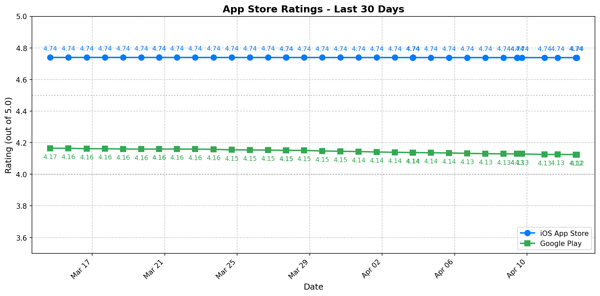

# App Rating History Report

**Generated:** 2026-02-13 16:34

---

## Current Ratings Overview

| Platform | Current Rating | 90-Day Trend | Change |
|----------|---------------|--------------|--------|
| iOS App Store | 4.74 | Stable | -0.00 |
| Google Play | 4.19 | Stable | -0.01 |

---

## 30-Day Rating Trend Chart

---

## iOS App Store Rating History

| Date | Rating | Rating Count |
|------|--------|--------------|
| 2026-02-13 | 4.74 | 3,986,513 |
| 2026-02-12 | 4.74 | 3,983,848 |
| 2026-02-11 | 4.74 | 3,983,848 |
| 2026-02-10 | 4.74 | 3,983,848 |
| 2026-02-08 | 4.74 | 3,981,342 |
| 2026-02-07 | 4.74 | 3,977,926 |
| 2026-02-06 | 4.74 | 3,977,926 |
| 2026-02-06 | 4.74 | 3,977,926 |
| 2026-02-05 | 4.74 | 3,976,401 |
| 2026-02-04 | 4.74 | 3,973,087 |
| 2026-02-03 | 4.74 | 3,973,087 |
| 2026-02-02 | 4.74 | 3,973,087 |
| 2026-02-01 | 4.74 | 3,971,043 |
| 2026-01-31 | 4.74 | 3,969,677 |
| 2026-01-30 | 4.74 | 3,969,677 |
| 2026-01-30 | 4.74 | 3,969,677 |
| 2026-01-29 | 4.74 | 3,965,628 |
| 2026-01-28 | 4.74 | 3,965,628 |
| 2026-01-27 | 4.74 | 3,965,628 |
| 2026-01-27 | 4.74 | 3,965,628 |

---

## Google Play Store Rating History

| Date | Rating | Rating Count | Installs |
|------|--------|--------------|----------|
| 2026-02-13 | 4.19 | 873,264 | 100,000,000+ |
| 2026-02-12 | 4.19 | 872,920 | 100,000,000+ |
| 2026-02-11 | 4.19 | 872,599 | 100,000,000+ |
| 2026-02-10 | 4.19 | 872,255 | 100,000,000+ |
| 2026-02-08 | 4.19 | 871,765 | 100,000,000+ |
| 2026-02-07 | 4.19 | 871,504 | 100,000,000+ |
| 2026-02-06 | 4.19 | 871,208 | 100,000,000+ |
| 2026-02-06 | 4.19 | 871,208 | 100,000,000+ |
| 2026-02-05 | 4.19 | 870,859 | 100,000,000+ |
| 2026-02-04 | 4.19 | 870,492 | 100,000,000+ |
| 2026-02-03 | 4.19 | 870,159 | 100,000,000+ |
| 2026-02-02 | 4.19 | 869,861 | 100,000,000+ |
| 2026-02-01 | 4.19 | 869,688 | 100,000,000+ |
| 2026-01-31 | 4.19 | 869,474 | 100,000,000+ |
| 2026-01-30 | 4.19 | 869,168 | 100,000,000+ |
| 2026-01-30 | 4.19 | 869,168 | 100,000,000+ |
| 2026-01-29 | 4.19 | 868,823 | 100,000,000+ |
| 2026-01-28 | 4.19 | 868,456 | 100,000,000+ |
| 2026-01-27 | 4.19 | 868,273 | 100,000,000+ |
| 2026-01-27 | 4.19 | 868,273 | 100,000,000+ |

---

## Google Play Rating Distribution (Current)

| Stars | Count | Percentage |
|-------|-------|------------|
| 5 | 625,758 | 71.7% |
| 4 | 69,636 | 8.0% |
| 3 | 25,068 | 2.9% |
| 2 | 20,562 | 2.4% |
| 1 | 132,223 | 15.1% |

---

*Generated by Weekly Friday Scraper - Rating History Module*
