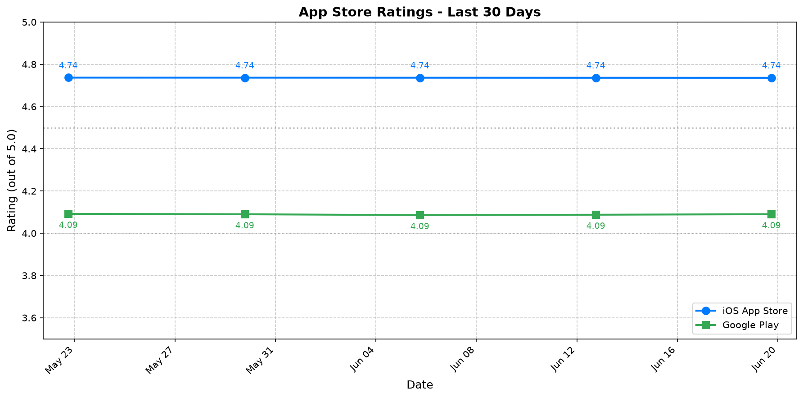

# App Rating History Report

**Generated:** 2026-04-12 16:27

---

## Current Ratings Overview

| Platform | Current Rating | 90-Day Trend | Change |
|----------|---------------|--------------|--------|
| iOS App Store | 4.74 | Stable | -0.00 |
| Google Play | 4.12 | Stable | -0.07 |

---

## 30-Day Rating Trend Chart

---

## iOS App Store Rating History

| Date | Rating | Rating Count |
|------|--------|--------------|
| 2026-04-12 | 4.74 | 4,047,993 |
| 2026-04-11 | 4.74 | 4,047,208 |
| 2026-04-10 | 4.74 | 4,046,243 |
| 2026-04-09 | 4.74 | 4,044,870 |
| 2026-04-09 | 4.74 | 4,044,870 |
| 2026-04-09 | 4.74 | 4,044,870 |
| 2026-04-09 | 4.74 | 4,045,303 |
| 2026-04-08 | 4.74 | 4,044,252 |
| 2026-04-07 | 4.74 | 4,043,373 |
| 2026-04-06 | 4.74 | 4,042,598 |
| 2026-04-05 | 4.74 | 4,041,997 |
| 2026-04-04 | 4.74 | 4,040,050 |
| 2026-04-03 | 4.74 | 4,038,946 |
| 2026-04-03 | 4.74 | 4,040,050 |
| 2026-04-02 | 4.74 | 4,038,946 |
| 2026-04-01 | 4.74 | 4,038,036 |
| 2026-03-31 | 4.74 | 4,035,950 |
| 2026-03-30 | 4.74 | 4,035,950 |
| 2026-03-29 | 4.74 | 4,034,235 |
| 2026-03-28 | 4.74 | 4,033,175 |

---

## Google Play Store Rating History

| Date | Rating | Rating Count | Installs |
|------|--------|--------------|----------|
| 2026-04-12 | 4.12 | 889,538 | 100,000,000+ |
| 2026-04-11 | 4.13 | 889,314 | 100,000,000+ |
| 2026-04-10 | 4.13 | 889,189 | 100,000,000+ |
| 2026-04-09 | 4.13 | 888,752 | 100,000,000+ |
| 2026-04-09 | 4.13 | 888,752 | 100,000,000+ |
| 2026-04-09 | 4.13 | 888,752 | 100,000,000+ |
| 2026-04-09 | 4.13 | 888,728 | 100,000,000+ |
| 2026-04-08 | 4.13 | 888,387 | 100,000,000+ |
| 2026-04-07 | 4.13 | 888,085 | 100,000,000+ |
| 2026-04-06 | 4.13 | 887,855 | 100,000,000+ |
| 2026-04-05 | 4.14 | 887,675 | 100,000,000+ |
| 2026-04-04 | 4.14 | 887,516 | 100,000,000+ |
| 2026-04-03 | 4.14 | 887,278 | 100,000,000+ |
| 2026-04-03 | 4.14 | 887,277 | 100,000,000+ |
| 2026-04-02 | 4.14 | 887,000 | 100,000,000+ |
| 2026-04-01 | 4.14 | 886,629 | 100,000,000+ |
| 2026-03-31 | 4.14 | 886,266 | 100,000,000+ |
| 2026-03-30 | 4.15 | 885,942 | 100,000,000+ |
| 2026-03-29 | 4.15 | 885,762 | 100,000,000+ |
| 2026-03-28 | 4.15 | 885,541 | 100,000,000+ |

---

## Google Play Rating Distribution (Current)

| Stars | Count | Percentage |
|-------|-------|------------|
| 5 | 623,808 | 70.1% |
| 4 | 70,971 | 8.0% |
| 3 | 25,420 | 2.9% |
| 2 | 20,665 | 2.3% |
| 1 | 148,661 | 16.7% |

---

## iOS App Store Rating Distribution (from Reviews)

| Stars | Count | Percentage |
|-------|-------|------------|
| 5 | 3,596,469 | 87.4% |
| 4 | 267,206 | 6.5% |
| 3 | 79,753 | 1.9% |
| 2 | 33,050 | 0.8% |
| 1 | 137,510 | 3.3% |

---

*Generated by Weekly Friday Scraper - Rating History Module*
