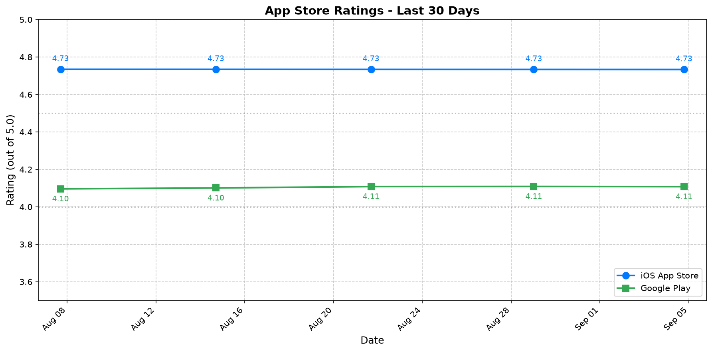

# App Rating History Report

**Generated:** 2026-09-11 19:01

---

## Current Ratings Overview

| Platform | Current Rating | 90-Day Trend | Change |
|----------|---------------|--------------|--------|
| iOS App Store | 4.73 | Stable | -0.00 |
| Google Play | 4.11 | Stable | +0.02 |

---

## 30-Day Rating Trend Chart

---

## iOS App Store Rating History

| Date | Rating | Rating Count |
|------|--------|--------------|
| 2026-09-11 | 4.73 | 4,193,509 |
| 2026-09-04 | 4.73 | 4,185,733 |
| 2026-08-29 | 4.73 | 4,178,127 |
| 2026-08-21 | 4.73 | 4,169,812 |
| 2026-08-14 | 4.73 | 4,162,545 |
| 2026-08-07 | 4.73 | 4,155,296 |
| 2026-07-31 | 4.73 | 4,148,057 |
| 2026-07-24 | 4.73 | 4,141,329 |
| 2026-07-17 | 4.74 | 4,134,658 |
| 2026-07-10 | 4.74 | 4,128,180 |
| 2026-07-03 | 4.74 | 4,122,380 |
| 2026-06-26 | 4.74 | 4,116,413 |
| 2026-06-19 | 4.74 | 4,110,171 |
| 2026-06-12 | 4.74 | 4,104,278 |
| 2026-06-05 | 4.74 | 4,097,609 |
| 2026-05-29 | 4.74 | 4,091,126 |
| 2026-05-22 | 4.74 | 4,085,367 |
| 2026-05-15 | 4.74 | 4,078,858 |
| 2026-05-08 | 4.74 | 4,068,803 |
| 2026-05-01 | 4.74 | 4,063,540 |

---

## Google Play Store Rating History

| Date | Rating | Rating Count | Installs |
|------|--------|--------------|----------|
| 2026-09-11 | 4.11 | 926,191 | 100,000,000+ |
| 2026-09-04 | 4.11 | 924,253 | 100,000,000+ |
| 2026-08-29 | 4.11 | 922,518 | 100,000,000+ |
| 2026-08-21 | 4.11 | 920,571 | 100,000,000+ |
| 2026-08-14 | 4.10 | 918,812 | 100,000,000+ |
| 2026-08-07 | 4.10 | 917,121 | 100,000,000+ |
| 2026-07-31 | 4.09 | 915,369 | 100,000,000+ |
| 2026-07-24 | 4.09 | 913,625 | 100,000,000+ |
| 2026-07-17 | 4.09 | 911,980 | 100,000,000+ |
| 2026-07-10 | 4.09 | 910,120 | 100,000,000+ |
| 2026-07-03 | 4.09 | 908,454 | 100,000,000+ |
| 2026-06-26 | 4.09 | 906,757 | 100,000,000+ |
| 2026-06-19 | 4.09 | 904,977 | 100,000,000+ |
| 2026-06-12 | 4.09 | 903,209 | 100,000,000+ |
| 2026-06-05 | 4.09 | 901,276 | 100,000,000+ |
| 2026-05-29 | 4.09 | 899,473 | 100,000,000+ |
| 2026-05-22 | 4.09 | 897,676 | 100,000,000+ |
| 2026-05-15 | 4.09 | 895,744 | 100,000,000+ |
| 2026-05-08 | 4.09 | 893,630 | 100,000,000+ |
| 2026-05-01 | 4.10 | 892,661 | 100,000,000+ |

---

## Google Play Rating Distribution (Current)

| Stars | Count | Percentage |
|-------|-------|------------|
| 5 | 647,826 | 69.9% |
| 4 | 71,980 | 7.8% |
| 3 | 26,157 | 2.8% |
| 2 | 21,768 | 2.4% |
| 1 | 158,452 | 17.1% |

---

## iOS App Store Rating Distribution (from Reviews)

| Stars | Count | Percentage |
|-------|-------|------------|
| 5 | 3,719,040 | 87.3% |
| 4 | 275,283 | 6.5% |
| 3 | 82,592 | 1.9% |
| 2 | 34,428 | 0.8% |
| 1 | 148,059 | 3.5% |

---

*Generated by Weekly Friday Scraper - Rating History Module*
